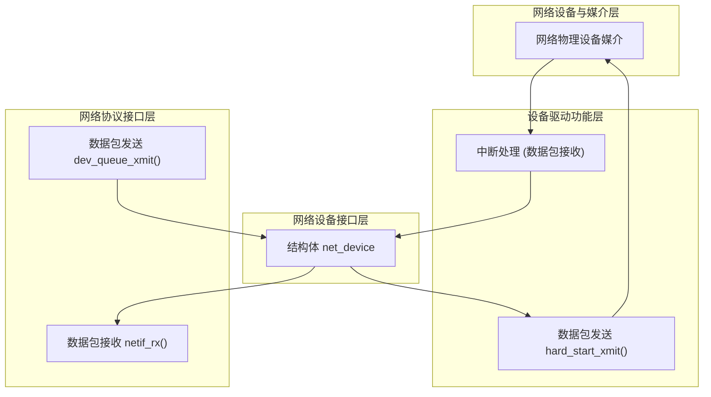

```mermaid
graph TB
	subgraph  网络设备与媒介层
		id6["网络物理设备媒介"]
	end

	subgraph 设备驱动功能层
		id4["数据包发送 hard_start_xmit()"]
		id5["中断处理 (数据包接收)"]
	end
		
	subgraph 网络设备接口层
		id3[结构体 net_device]
	end
	
	subgraph 网络协议接口层
		id1["数据包发送 dev_queue_xmit()"]
		id2["数据包接收 netif_rx()"]
	end
	id3-->id2
	id1-->id3
	id3-->id4
	id5-->id3
	id4-->id6
	id6-->id5
```

